# 📋 SỔ TAY THỰC HÀNH CÁ NHÂN & CHECKLIST TIẾN ĐỘ

---

## 🎯 HÌNH THỨC THỰC HIỆN: CÁ NHÂN

Bài thực hành thiết kế dành cho cá nhân học viên làm chủ quy trình phát triển Tác tử AI (AI Agent):
- Mỗi học viên tự Fork Repo về GitHub cá nhân.
- Tự hoàn thiện mã nguồn, tự đẩy bài nộp lên LMS VLearn.

---

## ⏱️ LỘ TRÌNH THỰC HÀNH (180 PHÚT LÀM BÀI)

```mermaid
gantt
    title TIẾN TRÌNH THỰC HÀNH 180 PHÚT
    dateFormat  m
    axisFormat %M m
    
    Phần 1: Agentic Fit & Tool Schemas       :m1, 0, 45m
    Phần 2: ReAct Loop & MCP Server          :m2, after m1, 60m
    Phần 3: Test Execution & Trace Log       :m3, after m2, 45m
    Phần 4: Self-Audit & Push GitHub Nộp bài :m4, after m3, 30m
```



---

## 📝 CHECKLIST CÁ NHÂN THEO TỪNG MỐC THỜI GIAN

### 🔷 PHẦN 1 (45 phút): Đánh giá Agentic Fit & Tool Schemas
* [x] Chọn 1 chủ đề thực tế từ tệp `docs/DANH_SACH_DE_TAI.md`. *(Đề tài Mở — Trợ lý Quản lý Chi tiêu Cá nhân)*
* [x] Điền bảng Scoring Matrix 4 tiêu chí Agentic Fit vào file `docs/trace_eval.md`. *(Tổng điểm 15/20)*
* [x] Khai báo Tool Schema đúng chuẩn JSON Schema cho công cụ hành động vào file `src/tools.py`. *(Đổi tên tool theo chủ đề mới: `add_expense` thay cho `schedule_appointment` mẫu; tool tra cứu `expense_query` cũng đã khai báo đầy đủ)*
* [x] Thêm 5 câu test case thực tế vào file `config/test_cases.json`. *(TC01–TC05, không còn dòng TODO)*

---

### 🔷 PHẦN 2 (60 phút): ReAct Agent & MCP Server
* [x] Hoàn thiện hàm thực thi gọi Tool theo chuẩn giao thức MCP trong `src/mcp_server.py`. *(`call_tool()` đóng gói phản hồi chuẩn JSON-RPC 2.0)*
* [x] Chạy lệnh `python src/mcp_server.py` xác nhận khởi tạo thành công MCP Server. *(Đã verify: khởi tạo `expense-tracker-mcp-server`, công bố 2 Tools)*
* [x] Lắp ráp vòng lặp ReAct Native Tool Calling trong `src/app.py`. *(Đã tùy biến phần tổng hợp Final Answer cho đúng dữ liệu chi tiêu)*

---

### 🔷 PHẦN 3 (45 phút): Chạy Kiểm thử & Xuất Trace Waterfall Log
* [x] Điền API Key thật vào file `.env`. *(Dùng `GROQ_API_KEY`, model `openai/gpt-oss-120b` — API tương thích chuẩn OpenAI SDK, hỗ trợ Native Tool Calling)*
* [x] Chạy lệnh `python src/app.py --all` cho 5 test cases. *(5/5 test case pass trên API thật)*
* [x] Kiểm tra file vết `docs/trace_waterfall.json` xuất ra đầy đủ độ trễ (latency_ms) và chi tiết các bước. *(9 sự kiện Thought → Action → Observation → Final Answer)*
* [x] Dán đoạn Trace log tóm tắt vào file `docs/trace_eval.md`. *(Trích 2 đoạn tiêu biểu: `expense_query` và `add_expense`)*

---

### 🔷 PHẦN 4 (30 phút): Tự kiểm tra & Nộp bài Git/GitHub
* [ ] Kiểm tra tên Repo cá nhân đúng chuẩn: **`K4-DAY03-<HoVaTen>_<MSSV>`**. *(Repo hiện tại tên `K4B-Day03-NguyenMinhQuan-2A202602490` — cần đối chiếu lại với quy định lớp học chính thức trước khi nộp)*
* [ ] Chạy lệnh Git để push toàn bộ mã nguồn lên GitHub cá nhân:
  ```bash
  git add .
  git commit -m "feat: complete Day 03 Lab Chatbot vs ReAct Agent"
  git push origin main
  ```
  *(Chưa thực hiện — code đã sẵn sàng, đang chờ lệnh commit/push)*
* [ ] Nộp link Repo GitHub cá nhân lên hệ thống VLearn.

---

> [!NOTE]
> **HOÀN THÀNH QUY TRÌNH:** Học viên đã xem xong Sổ tay thực hành. Để quay lại Trang chủ xem lại tổng quan bài học:  
> 👉 **[Quay lại Bước 1: Trang chủ README.md](../README.md)**
